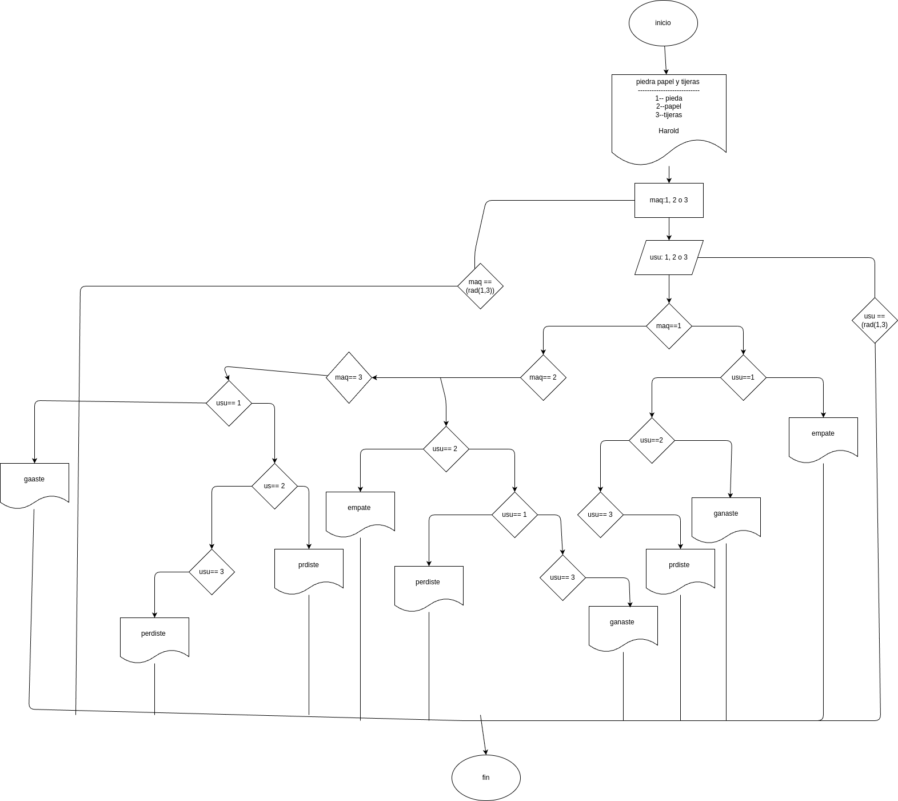

# Programa#1

# Piedra, Papel o Tijeras - Juego vs Máquina

Este es un proyecto de "Piedra, Papel o Tijeras" en el que el usuario juega contra una máquina.
# Analisis

## Imput
## Cómo jugar
1. El usuario elige una opción ingresando un número:
   - `1` = Piedra
   - `2` = Papel
   - `3` = Tijeras
2. La máquina genera aleatoriamente una de las tres opciones.
# processing
 Se comparan las opciones para determinar el resultado:
   - Gana el usuario 
   - Gana la máquina 
   - Empate 
# Outut
 El juego finaliza mostrando el resultado.

## diseño

